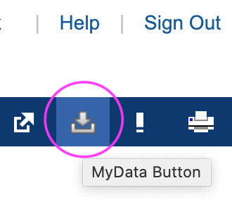

# powerschool-reporter

# Overview

Python script to generate a report card based on an export from powerschool.

Will generate an HTML  file, that you can display and print with your favorite browser

# Why?
As much as powerschool makes it easy to get up to date information, the end of term reporting is more awkward than I
wanted it to be. For example, seeing teacher comments involves clicking into grades, and there was no easy way to get an
copy of the "report card" to file for reference.

Since there is a way to export the student data, I thought it would be handy to have a tool to generate a concise report.


# Running 

## Install Python

* Install Python3 (on a Mac or linix you can use
    * [homebrew](https://brew.sh/)
        * Follow the instructions to install homebrew then type `brew install python3`
    * Download from [Python.org](https://www.python.org/)

## Download the data file
Log on to the Powerschool parent portal in a web browser. You should see a _Export Data_ icon near the top right. 
click on the item, and note where the file downloads (usually your _Downloads_ folder).



## Run the Script

* Run the Script: `./parser.py <path to xml file>`
You will see 1 HTML file for each school year that has the file has grade data for.

Running the script without arguments will provide help information. 


# Developing and customizing

The code has 2 files:
* `parser.py`: which reads the XML data file from powerschool and creates a report card
* `reportCard.css` : which contains the file 

## Dependencies

For the sake of simplicity, I choose to make it possible to run with only python 3 installed.
The install step with `requirements.txt` is for completeness.

* Python 3

```$shell
python3 -m venv env
source  env/bin/activate
pip install -r requirements.txt
```

